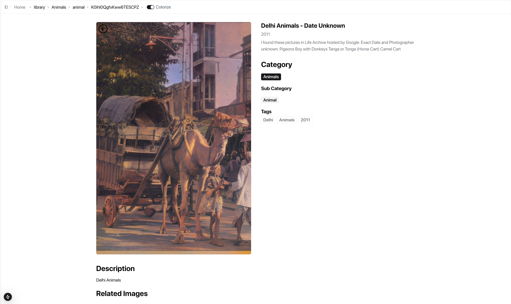

    
    <h1 align="center" style="letter-spacing:24px;font-size:32px;">PIKASO</h1>
    <h1 align="center" style="letter-spacing:18px;font-size:18px;">SANSKRITI</h1>

  <a href="https://github.com/sinhaGuild">
    
by sinhaguild

  </a>
    

## Introduction

# Sanskriti
Sanskriti application features:
- Upload a user selected black and white image and colorize it using modern diffusion models.
- Generate metadata using modern image recognition models and store it.
- Credit based generation system.
- Browse a large collection of photographs from the 17th-19th century India.
- Browse thematic `stories` from this time period (generated using `k-means` clustering).
- `Colorize` switch will toggle original vs. colorized images. 

## Technology Stack used
- `Next.js`
- `Firebase Storage`
- `Firestore Database`
- `Clerk Authentication`
- `Stripe Payments`
- `Zustand State Management`
- `ZOD types`

## Screens

  
  
  
  
  
  

